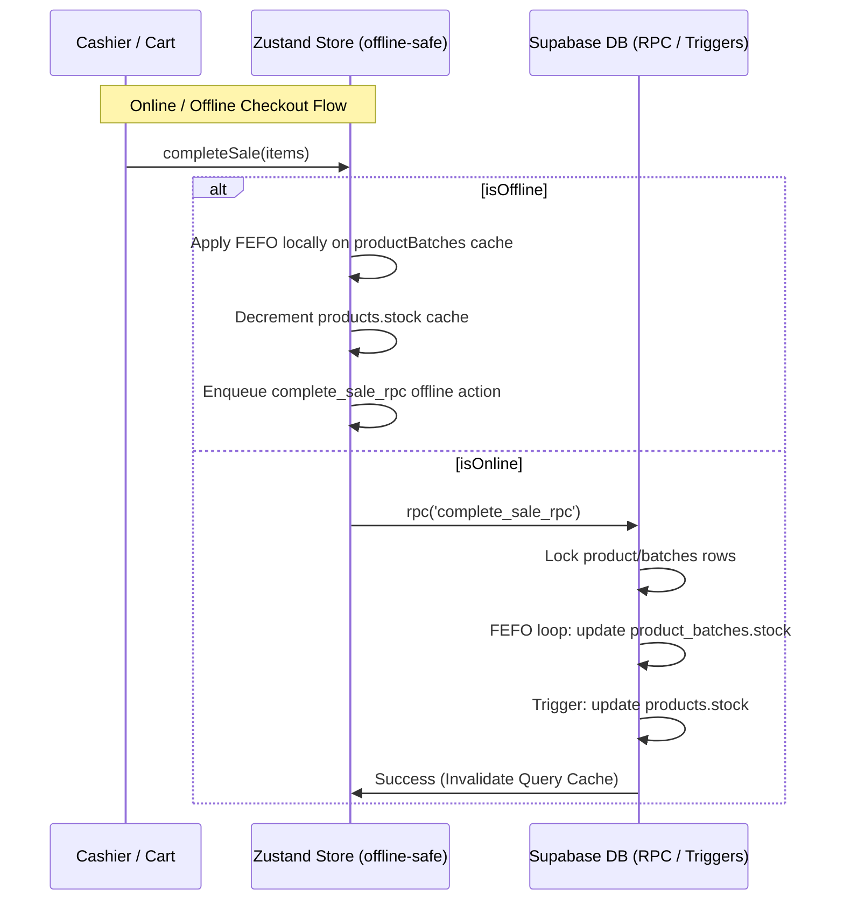

# Design: Batch Expiration Tracking

## Technical Approach
We will implement **Approach 1 (Database-Driven FEFO)**. The database will serve as the single source of truth for all product batches. 

1. **Schema Updates**:
   - Add `"controlLotes"` (`BOOLEAN DEFAULT FALSE`) to `public.products`.
   - Create `public.product_batches` to track individual batches with their expiration dates and quantities.
   - Implement an index on `("productId", "expirationDate")` to optimize FEFO queries.
   - Configure a Postgres trigger `trg_sync_product_stock_from_batches` on `public.product_batches` to keep `public.products.stock` in sync.
2. **Transaction & Database RPCs**:
   - Refactor [complete_sale_rpc](file:///C:/Users/facu/kiosko-pos/SUPABASE_SCHEMA.sql#L232-L351) to check if a product has batch control enabled, verify total batch stock, and deduct sequentially from earliest-expiring active batches (`"expirationDate" ASC, created_at ASC`) using `FOR UPDATE` to prevent concurrent race conditions/deadlocks.
   - Refactor [receive_goods_rpc](file:///C:/Users/facu/kiosko-pos/SUPABASE_SCHEMA.sql#L429-L518) to capture batch details (`"batchCode"` and `"expirationDate"`) for items received and upsert them into `public.product_batches` while updating global product stock and cost.
3. **Zustand Offline Cache**:
   - Add `product_batches` query and mutation hooks in [store.jsx](file:///C:/Users/facu/kiosko-pos/src/lib/store.jsx).
   - Replicate the FEFO cascading deduction logic on the local state cache in `completeSale` (offline path).
   - Replicate batch creation/updates in the local state cache in `receiveGoods` (offline path).
4. **UI Warnings**:
   - In `venta.jsx`, check product expiration dates in the cart and show alerts for expired or near-expiration items.

## Architecture Decisions
### Decision: Database-Driven FEFO with Postgres Trigger
**Choice**: Use `complete_sale_rpc` to handle batch stock decrement, and a Postgres trigger `trg_sync_product_stock_from_batches` to keep `public.products.stock` in sync.
**Alternatives considered**: Client-driven batch deduction, where the React app sends the specific batch IDs to decrement.
**Rationale**: Client-driven deduction is highly prone to race conditions (e.g. concurrent cashiers trying to deduct the same batch) and extremely difficult to reconcile during offline synchronization. An atomic DB-level sequential deduction ensures correctness and transaction safety. The Postgres trigger simplifies stock tracking, ensuring the global `stock` field is always consistent with the sum of active batch stocks.

### Decision: Unique Constraint on Product ID and Batch Code
**Choice**: Add `UNIQUE ("productId", "batchCode")` to `public.product_batches`.
**Alternatives considered**: Allow duplicate batch codes under different expiration dates.
**Rationale**: In most retail POS scenarios, a batch code uniquely identifies a shipment/manufacture batch. Restricting duplicate codes under the same product prevents duplicate entry clutter. If a product has the same batch code but multiple dates, it is treated as the same batch, and its stock is updated, or it's disallowed.

## Data Flow


## File Changes
| File | Action | Description |
|------|--------|-------------|
| [SUPABASE_SCHEMA.sql](file:///C:/Users/facu/kiosko-pos/SUPABASE_SCHEMA.sql) | Modified | Add `"controlLotes"` to `products`; create `product_batches` table, indexes, trigger `trg_sync_product_stock_from_batches`; update `complete_sale_rpc` and `receive_goods_rpc`. |
| [src/lib/store.jsx](file:///C:/Users/facu/kiosko-pos/src/lib/store.jsx) | Modified | Integrate `product_batches` query, state cache (`batchesCache`), offline action queue handling (`RECEIVE_GOODS` custom logic, local FEFO helper for checkout). |
| [src/components/pos/stock/stock.jsx](file:///C:/Users/facu/kiosko-pos/src/components/pos/stock/stock.jsx) | Modified | Update product form to toggle `"controlLotes"`; display list of active/expired batches for products; manage batch manual adjustment. |
| [src/components/pos/proveedores/proveedores.jsx](file:///C:/Users/facu/kiosko-pos/src/components/pos/proveedores/proveedores.jsx) | Modified | Update goods receiving UI to capture batch code and expiration date for batch-controlled products. Remove client-side loop calling `updateProduct`. |
| [src/components/pos/venta/venta.jsx](file:///C:/Users/facu/kiosko-pos/src/components/pos/venta/venta.jsx) | Modified | Check and display warning badges for expired/expiring batches when adding items to cart. |

## Interfaces / Contracts
### 1. Schema Additions
```sql
ALTER TABLE public.products ADD COLUMN "controlLotes" BOOLEAN DEFAULT FALSE;

CREATE TABLE public.product_batches (
    id TEXT PRIMARY KEY,
    created_at TIMESTAMPTZ DEFAULT NOW(),
    "productId" TEXT NOT NULL REFERENCES public.products(id) ON DELETE CASCADE,
    "batchCode" TEXT NOT NULL,
    "expirationDate" TIMESTAMPTZ NOT NULL,
    stock NUMERIC DEFAULT 0 CHECK (stock >= 0),
    CONSTRAINT product_batches_product_batch_unique UNIQUE ("productId", "batchCode")
);

CREATE INDEX IF NOT EXISTS idx_product_batches_product_expiration 
ON public.product_batches("productId", "expirationDate");
```

### 2. DB Functions
#### `complete_sale_rpc` (Updated segment)
```sql
-- For each item in p_items:
-- If "controlLotes" is enabled:
--   Verify sum(stock) >= item.qty in product_batches
--   Loop product_batches order by "expirationDate" ASC, created_at ASC FOR UPDATE
--     Deduct qty cascadingly until done
-- Trigger trg_sync_product_stock_from_batches will update products.stock automatically.
```

#### `receive_goods_rpc` (Updated segment)
```sql
-- For each item in p_items:
--   Update products.cost (unit cost = cost / totalUnits)
--   If "controlLotes" is false:
--     Update products.stock = stock + totalUnits
--   If "controlLotes" is true:
--     Upsert into product_batches:
--       INSERT INTO public.product_batches (id, "productId", "batchCode", "expirationDate", stock)
--       VALUES (gen_uuid(), item."productId", item."batchCode", item."expirationDate", item."totalUnits")
--       ON CONFLICT ("productId", "batchCode") DO UPDATE
--       SET stock = product_batches.stock + EXCLUDED.stock;
--     Trigger trg_sync_product_stock_from_batches will update products.stock automatically.
```

## Testing Strategy
| Layer | What to Test | Approach |
|------|--------|-------------|
| **Database** | FEFO deduction cascade and trigger synchronization. | SQL integration tests (check stock counts after sale and goods receipt). |
| **Store (Offline)** | Offline sale FEFO local deduction and sync queue. | Jest unit tests simulating offline checkout and online reconciliation. |
| **UI** | Expiration date warning banners. | Component unit tests verifying warning renders for expired batches. |

## Migration / Rollout
1. Run SQL migration script to update schema, add trigger, and update RPCs.
2. Default all existing products to `"controlLotes" = FALSE` (no initial migration required for existing items).
